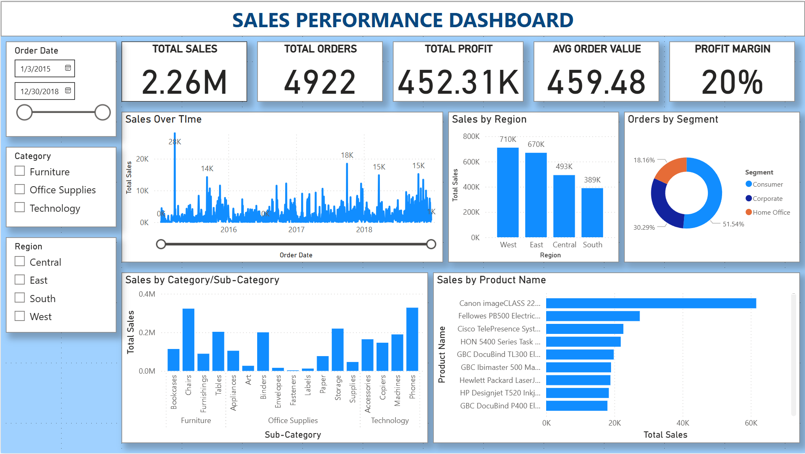

# 📊 Sales Performance Dashboard

This interactive dashboard was built using **Power BI** and the [Superstore Sales dataset](https://www.kaggle.com/datasets/rohitsahoo/sales-forecasting/data) to analyze key sales KPIs across product categories, regions, and time.

---

## 🚀 Key Features

- 📦 Total Sales, Profit, Orders, and Avg Order Value KPIs
- 📅 Interactive date range slicers
- 🌍 Regional sales breakdown with bar charts
- 🧠 Product insights by Category and Sub-Category
- 📈 Drill-down capability by Product Name

---

## 📷 Dashboard Preview

---

## ⚙️ Tech Stack

- **Power BI** – Dashboarding & data modeling
- **DAX** – Calculated columns and custom measures
- **CSV (Superstore Dataset)** – Source data

---

## 📁 Files Included

- `Sales_Performance_Dashboard.pbix` – Main dashboard file *(optional)*
- `Superstore_Sales_Dataset.csv` – Data used for the report
- `images/` – Screenshots of visuals

---

## 🧠 Insights Derived

- Phones, Chairs, and Storage were the top-selling sub-categories.
- West region had the highest total sales across the country.
- Consumer segment made up more than 50% of total orders.
- Profit margin held steady at ~20% across all categories.

---

## 🔗 Try It Yourself

> Note: You need Power BI Desktop to open the `.pbix` file.  
> [Download Power BI Desktop](https://powerbi.microsoft.com/desktop/)

